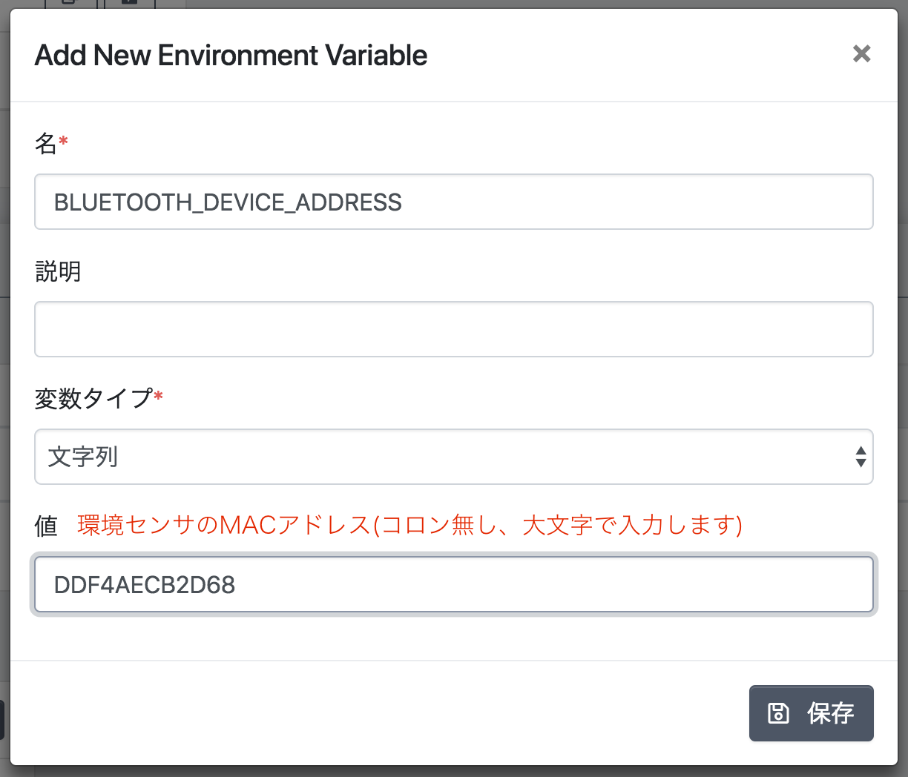

# オムロン環境センサ・Ambient・isaaxハンズオン

BLEセンサーデバイスとラズパイを使ってセンサーデータの可視化をしてみましょう。BLEデバイスにはオムロン環境センサ(2JCIE-BL01)、センサーデータの可視化にはAmbient.ioを使っていきます。

- [オムロン環境センサ - 2JCIE-BL01](https://www.omron.co.jp/ecb/product-info/sensor/iot-sensor/environmental-sensor)
- [Ambient - IoTデータ可視化サービス](https://ambidata.io/)

_※ isaax勉強会では必要なライブラリのインストール時間を節約するためにあらかじめ用意したSDカードを使用します。公式のRaspbianを使って1からセットアップする場合はこの記事の最後にある付録をご覧ください。_

## サンプルコードのフォーク

isaaxを使ってデバイスに配信するプログラムはGitリポジトリ(以下、リポジトリ)として管理します。今回はあらかじめ用意したサンプルコードをフォークして使います（フォークしたくない場合は、クローンして新規リポジトリとして作成してください）。

> リポジトリとは、ファイルやディレクトリの変更履歴を保持したプログラムファイルの集合です。Gitを使って開発する場合、大抵は1つのアプリケーションごとに1リポジトリ作成します(もちろん例外もあります)。

- [サンプルコード - GitHub](https://github.com/isaaxug/envsensor-ambient)


## isaaxプロジェクトの作成

前節で自分のGitHubアカウントにフォークしたリポジトリを使ってisaaxにプロジェクトを作成します。isaaxアカウントをまだ作成していない場合はこのタイミングで登録しましょう(GitHubアカウントを使って登録すると便利です)。

- [isaax.io - 公式ページ](https://isaax.io/)

「新規プロジェクト追加」から新しいプロジェクトを作成します。


下図のように設定し、「保存」ボタンをクリックします。


## デバイスの登録

作成したプロジェクトにデバイスを登録します。登録するにあたって、ラズベリーパイ側にはisaaxdというソフトウェアをインストールする必要があります。isaaxdは私たちがデバイスにインストールするアプリケーションの管理（起動、停止、ログの収集等）を担っています。

プロジェクトの作成後、下図のような画面が表示されます。プロジェクトトークンはデバイスにisaaxdをインストールする際に必要となります。インストールスクリプトはそのトークンを引数としてisaaxdのインストールをワンコマンド実行するためのスクリプトです。背景が黒い方の文字列をコピーしてください。


コピーしたコマンドはラズベリーパイ上で実行します。WindowsならPuttyやTeraTerm、MacやLinuxならターミナルを使ってラズパイにSSH接続しましょう。ユーザー名は`pi`、パスワードは`raspberry`です。

ログインに成功したら、コピーした文字列をラズパイ上で実行します。


上図のように`isaaxd installation complete`が表示されればインストール成功です。

## isaaxを使ったログデータの確認

isaaxdのインストールが完了した時点でサンプルコードも同時にインストールされています。サンプルコードは、オムロン環境センサのアドバタイズパケットからセンサーデータを取得し、その中から温度を標準出力するシンプルなスクリプトです。isaaxdはこのアプリケーションの標準出力と、標準エラー出力を監視してクラウドにログデータとして送信します。

ダッシュボードに戻り、登録したデバイスの状態を確認しましょう。プロジェクトトークンのモーダルを閉じ、クラスターをクリックします。

> クラスターはプロジェクトに対して複数作成することができ、その下に紐付くデバイスをグループごとに分けるための機能です。この機能によって、開発中のデバイスと本番のデバイスを切り分けるといった応用的な操作が可能になります。


クラスターページを開くと「最近のデバイス」に先ほど登録したデバイスが表示されます。「バージョン」はインストールされているisaaxdのバージョンを、「リビジョン」はインストールされているアプリケーションのコミットID(Gitで作成した履歴ごとに付与されるID)をそれぞれ示しています。デバイスをクリックしましょう。


下図がデバイスの詳細ページになります。赤色の丸で囲われたボタンをクリックするとインストールしたアプリケーションのログを確認することができます。ラズベリーパイが期待する動作をしないときなどはこちらにエラーログが上がっている可能性が高いので確認しましょう。そのほか、割り当てられているIPアドレスの確認やアプリケーションの起動・停止などの機能を備えています。


この時点では、デバイスログは`No sensors found.`と表示されています。サンプルコードでは環境変数から読み取ったMACアドレスを元にBLEデバイスの判別とセンサー値の取得をおこないます。次節でisaaxを使ってユーザーアプリケーションがアクセスできる環境変数を定義する方法について説明します。

## 環境変数サービス (ユーザー変数)

isaaxではAPIキーのような認証情報や環境によって異なるエンドポイントなど、ハードコーディングしたくないデータを切り分けてデプロイする機能があります。isaaxで登録したこのデータはデバイス上で環境変数としてアクセスできます。

クラスターページから「Cluster Settings」をクリックしてドロップダウンを開きます。


「ユーザー変数」タブから「＋環境変数追加」をクリックします。


サンプルアプリケーションでは環境変数`BLUETHOOTH_DEVICE_ADDRESS`からMACアドレスを取得します。値はそれぞれ手元の環境センサのMACアドレスに置き換えてください（勉強会では配った環境センサの箱に付箋でMACアドレスが記入してあるのでそちらを参照してください）。



保存後、「restart」ボタンをクリックし、デバイスログが`No sensors found.`から`Illumination: 254 lx`のような数値に置き換わっていれば成功です。ここでは照度を表示しています。カメラのライトなどでセンサーを照らしてみましょう。


## 課題1 任意のセンサーデータを出力しよう

## Ambientアカウント登録

- [サンプル - 環境センサを使った可視化の例](https://ambidata.io/ch/channel.html?id=5279)

- [Ambient - IoTデータ可視化サービス](https://ambidata.io/)

## チャンネル作成
## 環境変数の追加（チャンネルID, ライトキー）
## isaax.jsonのエントリーポイント変更

## 課題2 複数のチャネルに情報を送ろう

## 課題3 複数の環境センサに対応しよう

## 付録1. SDカードのセットアップ

勉強会で使用したOSは2018-06-27リリースのRaspbian Stretch Liteをベースに作成しました。

- [Raspbian - ダウンロードページ](https://www.raspberrypi.org/downloads/raspbian/)

サンプルコードを動作させるには下記のライブラリをインストールしてください。

```
sudo apt-get install -y libperl-dev
sudo apt-get install -y libgtk2.0-dev
sudo apt-get install -y libglib2.0
sudo apt-get install -y libbluetooth-dev libreadline-dev
sudo apt-get install -y libboost-python-dev libboost-thread-dev libboost-python-dev
sudo apt-get install -y python3-pip
sudo pip3 install pybluez
sudo pip3 install pygattlib
sudo pip3 install git+https://github.com/AmbientDataInc/ambient-python-lib.git
```

## 付録2. 事後学習のために

isaaxについてより深く知るためには、公式のドキュメントを読んだり、コミュニティで質問してみましょう。

- [isaaxではじめるIoTの第一歩！ – Isaaxキャンプ](https://camp.isaax.io/hc/ja/articles/360001411588)
- [Isaaxとは - isaax公式ドキュメント](https://isaax.io/docs/)
- [コミュニティ – Isaaxキャンプ](https://camp.isaax.io/hc/ja/community/topics)

無料の勉強会も開催しているので、ハンズオンしたい方はこちらにもご参加ください。

- [isaax User Group - connpass](https://isaaxug.connpass.com/)

SNSでもIoTに関する情報を発信しています。フォローお願いします。

- [XSHELL (@xshell_inc) | Twitter](https://twitter.com/xshell_inc)
- [Xshell - Facebookページ](https://www.facebook.com/xshellinc)